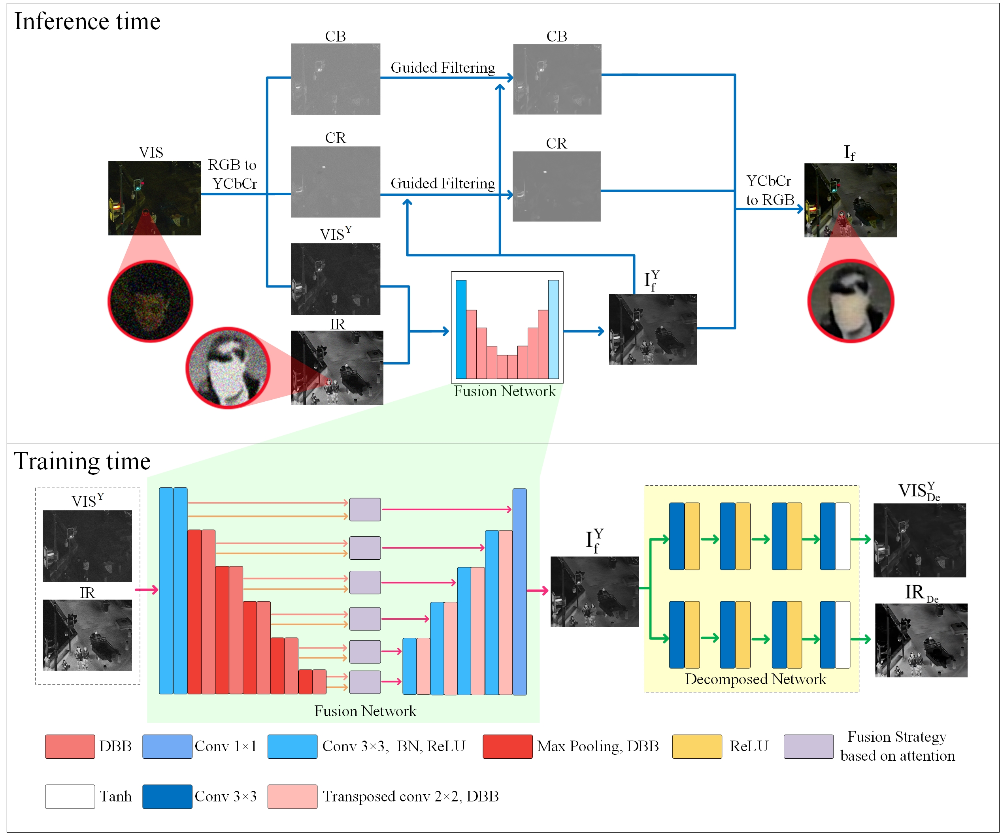
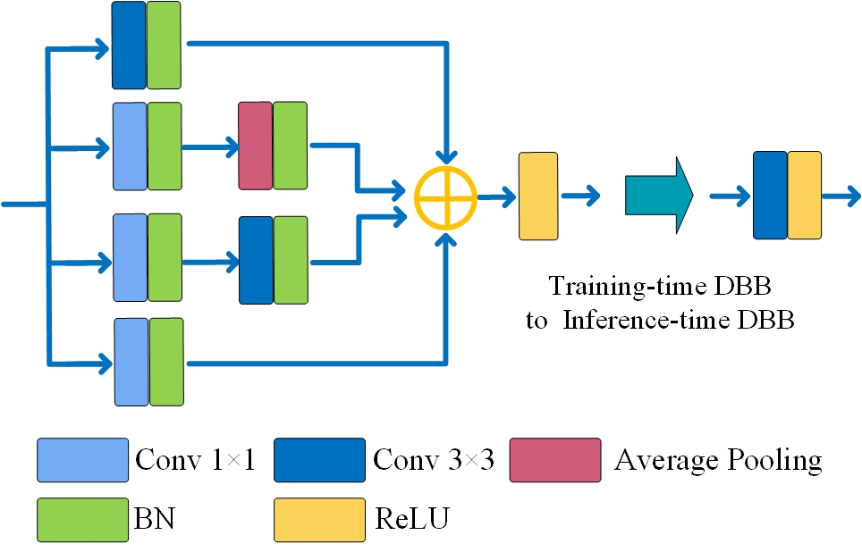
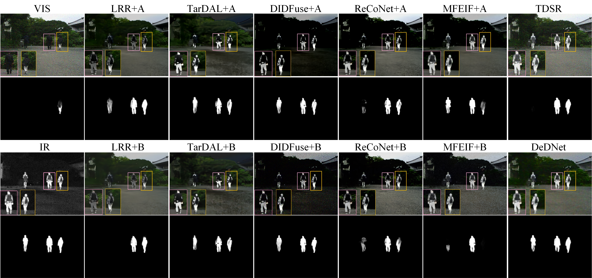
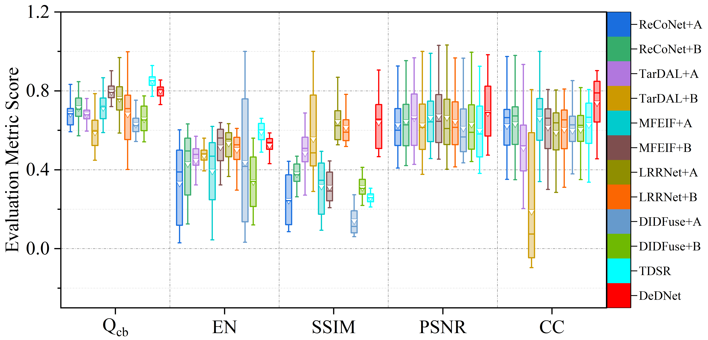

# DeDNet (Measurement 2024) 

Codes for ***DeDNet: Infrared and visible image fusion with noise removal by decomposition-driven network. (Measurement 2024)***

[Jingxue Huang](https://github.com/JasonWong30), [Xiaosong Li](https://github.com/lxs6), [Haishu Tan](https://www.fosu.edu.cn/mee/teachers/teachers-external/25647.html), [Lemiao Yang](), [Gao Wang](), [Peng Yi]().

-[*[Paper]*][https://openaccess.thecvf.com/content/ICCV2023/html/Zhao_DDFM_Denoising_Diffusion_Model_for_Multi-Modality_Image_Fusion_ICCV_2023_paper.html](https://www.sciencedirect.com/science/article/abs/pii/S0263224124009771) 

## Update
- [2025-1] README.md is updated.
- [2024-8] Codes and config files are public available.

## Citation

```
@article{huang2024dednet,
  title={DeDNet: Infrared and visible image fusion with noise removal by decomposition-driven network},
  author={Huang, Jingxue and Li, Xiaosong and Tan, Haishu and Yang, Lemiao and Wang, Gao and Yi, Peng},
  journal={Measurement},
  pages={115092},
  year={2024},
  publisher={Elsevier}
}
```

## Abstract

Infrared and visible image fusion integrates useful information from different modal images to generate one with comprehensive details and highlighted targets, thereby deepening the interpretation of the scene. However, existing deep-learning based methods do not consider noise, leading to suboptimal noisy fusion results. To address this issue, we propose a decomposition-driven neural network (DeDNet) to achieve joint fusion and noise removal. By introducing constraints between the fused and ground truth source images into the loss function, we develop an autoencoder as the basic fusion and denoising network. Furthermore, we propose a decomposition network that guided the decomposition of the fusion result, improving the denoising and details recovery. Experiments demonstrate DeDNet excels the state-of-the-art methods in objective and subjective evaluations, yielding competing performance in detection and segmentation. On the metrics,Qcb, EN, SSIM, PSNR, and CC, DeDNet average increased 10.92%, 21.13%, 82.97%, 8.55%, and 16.26% than the compared methods, respectively

### 🌐 Usage

### ⚙ 1. Virtual Environment

```
 - [ ] torch  1.12.1
 - [ ] torchvision 0.13.1
 - [ ] numpy 1.24.2
 - [ ] Pillow  8.4.0
```

### 📃 2. Pre-trained Checkpoint Preparation
From [the link]([https://github.com/openai/guided-diffusion](https://drive.google.com/drive/folders/1Pu_f3XkrU3-dZZYvFmmfauyGwGWYZ__Z?usp=sharing)), download the checkpoint and place it under the corresponding floder

### 🏊 3. Data Preparation

Download the Infrared-Visible Image Fusion (IVIF) and place the paired images in your own path. 

### 🏄 4. Inference

The user should adjust the argument (args.ir_dir and args.vi_dir) in the test.py for your own path of test dataset.

If you want to infer with our DeDNet and obtain the fusion results in our paper, please run

```
CUDA_VISIBLE_DEVICES=0 python test.py
```

Then, the fused results will be saved in the ``'./SeAFusion/'`` folder.

## 🙌 DeDNet

### Illustration of our DeDNet model.



### Detail of DBB.



### Qualitative fusion results with noise level sigma=30.



### Quantitative fusion results noise level sigma=30.



## 📖 Related Work
-  MMA-UNet: A Multi-Modal Asymmetric UNet Architecture for Infrared and Visible Image Fusion.* **arxiv 2024** https://arxiv.org/pdf/2404.17747. 
